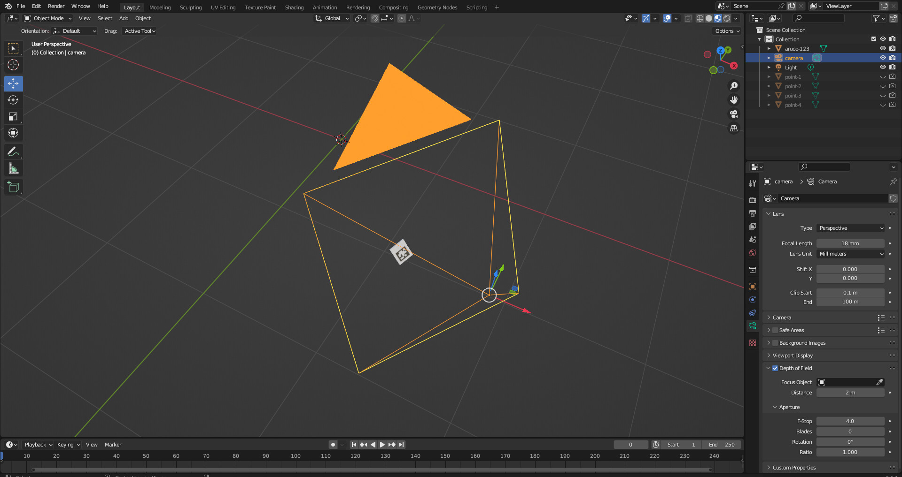

# Dataset generator for aruco pose estimator



The project aims to generate dataset for aruco pose estimation algorithm validation. The blender project is equipped with the python script `main.py` which captures aruco marker at randomly generated poses. The script also dumps into the file `/tmp/aruco-dataset/parameters.json`  the auxiliary information such as marker poses, camera intrinsics and extrinsics.

The rendered images are written to `/tmp/aruco-dataset`

|  |
| :---: |
|  Render result |

The file `parameters.json` looks as

```json
{
  "camera": {
    "intrinsics": [
      [1280.0, 0, 960.0 ],
      [ 0, 1280.0, 540.0 ],
      [ 0, 0, 1 ]
    ],
    "position": [ 1.9740146398544312, 2.0286037921905518, -1.4990243911743164 ],
    "orientation": [ 0.7467635454245646, 0.4660553210498401, -0.24530256456840102, -0.40615673915648615 ]
  },
  "marker": {
    "size": 0.08,
    "id": 123,
    "pose": [
      {
        "position": [ 1.2305986186132465, 0.404534020385811, -1.0708045289380166],
        "orientation": [ -0.10009722763517154, 0.3799172368601033, 0.3430444870765838, -0.8532080156929496 ]
      },
      ...
    ]
  }
}
```

All the coordinates are given in world coordinate system frame with basis vectors `(x,y,z)`directed to Right Down Forward (RDF convention).
